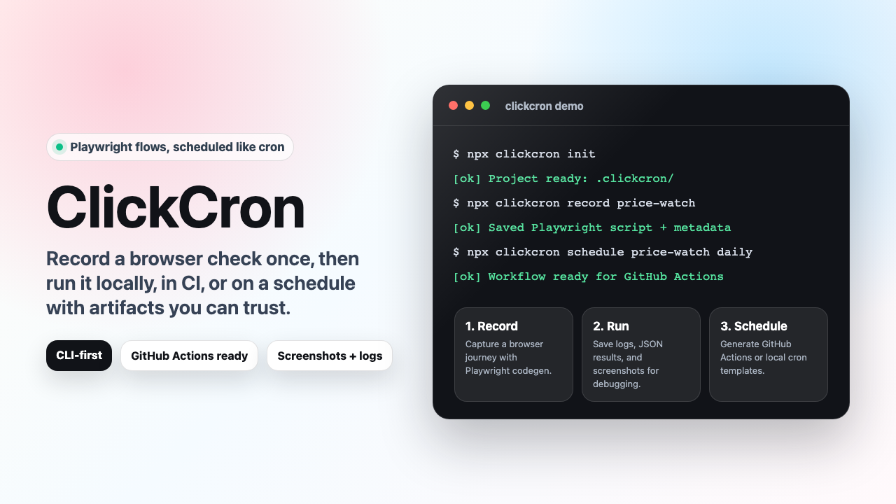

# ClickCron

Record once. Run forever.

[](https://github.com/vijay-kapse/ClickCron/actions/workflows/ci.yml)


ClickCron is a TypeScript CLI for turning browser clicks into scheduled Playwright checks. Record a flow, run it locally or in CI, and keep logs, screenshots, and JSON results for every run.

<p align="center">
  
</p>

<p align="center">
  <a href="./docs/assets/clickcron-demo.webm"><strong>Watch the short demo video</strong></a>
</p>

## Why It Exists

Manual browser checks are easy to forget and annoying to repeat. ClickCron gives developers a tiny, repo-friendly workflow for checks like:

- price, inventory, and content monitoring
- form smoke tests
- screenshot-based sanity checks
- job board, dashboard, and internal tool checks
- scheduled browser automations that should leave audit-ready artifacts

## Quickstart

```bash
git clone https://github.com/vijay-kapse/ClickCron.git
cd ClickCron
npm ci
npm run build
node dist/cli.js init
```

During development, run commands without rebuilding:

```bash
npm run dev -- --help
npm run dev -- init
npm run dev -- doctor --verbose
npm run dev -- list
```

After publishing or linking the package, use the CLI directly:

```bash
clickcron init
clickcron record price-checker https://example.com
clickcron schedule price-checker daily
clickcron run price-checker
```

## Commands

```bash
clickcron init [--cwd <path>] [--force]
clickcron record <name> <url> [--browser chromium|firefox|webkit]
clickcron run <name> [--dry-run] [--env <name>]
clickcron list [--json]
clickcron schedule <name> <alias-or-cron> [--timezone <tz>] [--force]
clickcron doctor [--verbose]
clickcron remove <name> [--runs]
clickcron export <name> [--format json|yaml]
```

## Scheduling

Use schedule aliases or a raw 5-field cron expression:

```bash
clickcron schedule price-checker hourly
clickcron schedule price-checker "0 9 * * *"
```

ClickCron writes a GitHub Actions workflow and prints a local-cron template so you can choose the runtime that fits your project.

## Artifacts

Each run is designed to leave a trail:

- execution log
- structured `result.json`
- screenshots directory
- schedule workflow for CI runs

That makes failures easier to debug and easier to share.

## Repo Scripts

```bash
npm run typecheck
npm run lint
npm test
npm run build
npm run verify
npm run assets
```

`npm run assets` regenerates the README hero image and demo WebM in `docs/assets/`.

## Safety

Only automate pages and accounts you own or are explicitly authorized to test. Keep secrets in environment variables locally and in GitHub Actions Secrets in CI. Do not commit credentials, tokens, session cookies, or generated storage state.

More detail: [docs/secrets.md](./docs/secrets.md).

## Examples

- [Price checker](./examples/price-checker/README.md)
- [Screenshot monitor](./examples/screenshot-monitor/README.md)
- [Form checker](./examples/form-checker/README.md)
- [Job board monitor](./examples/job-board-monitor/README.md)

## Launch Kit

Planning to share it? Use:

- Hero image: [docs/assets/clickcron-hero.png](./docs/assets/clickcron-hero.png)
- Demo video: [docs/assets/clickcron-demo.webm](./docs/assets/clickcron-demo.webm)
- LinkedIn copy: [docs/linkedin-launch-post.md](./docs/linkedin-launch-post.md)

## Roadmap

- next-run previews for schedules
- richer run history queries
- secret profile helpers
- optional hosted dashboard integrations

## Contributing

Issues and PRs are welcome. Please run `npm run verify` before opening a PR.
