# ClickCron

**Record once. Run forever.** Browser checks that _heal themselves_ with AI when the page changes.

[](https://github.com/vijay-kapse/ClickCron/actions/workflows/ci.yml)
[](https://www.npmjs.com/package/clickcron)


ClickCron is a tiny TypeScript CLI that records browser clicks (via Playwright) and runs them as
scheduled checks — locally or in CI. The twist: **when a site changes and a recorded selector
breaks, ClickCron repairs it with AI instead of failing.** It relocates the element from the live
page, verifies the fix, saves it back to the recipe, and keeps going.

> 🌐 **Landing page:** [clickcron.vercel.app](https://clickcron.vercel.app) · 📦 `npx clickcron`

<p align="center">
  
</p>

## The problem with scheduled browser checks

Every scheduled Playwright/Cypress check has the same failure mode: the site ships a redesign, a
selector goes stale, and your check goes red at 3am — not because anything is _broken_, but because
a button id changed. Someone has to wake up, re-record, and re-deploy.

**ClickCron fixes the selector for you.** When a recorded strategy stops matching, it:

1. Captures the live page's accessibility tree and visible elements.
2. Asks Claude to pick the single best replacement and return one selector strategy.
3. Verifies that strategy resolves to **exactly one** element (never guesses blindly).
4. Applies it, **persists** it back into the recipe, and logs an auditable before/after heal event.

Self-healing is opt-in (set `ANTHROPIC_API_KEY`), defaults to the cheap **Claude Haiku** model, and
**never silently swallows a real failure** — if it can't find a confident match, the run fails loudly.

## Quickstart

```bash
npx clickcron init                                   # scaffold a project
npx clickcron record price-checker https://example.com   # record a flow in your browser
export ANTHROPIC_API_KEY=sk-ant-...                  # enable AI self-healing (optional)
npx clickcron run price-checker                       # run it — and heal it if the page changed
npx clickcron schedule price-checker daily            # generate a GitHub Actions workflow
```

That's it — no account, no dashboard, no lock-in. Recipes live next to your code as plain files.

## Why not just…?

| Option                               | What happens when the UI changes                                                                              |
| ------------------------------------ | ------------------------------------------------------------------------------------------------------------- |
| **Plain Playwright/Cypress + cron**  | The selector breaks, the job goes red, a human re-records and redeploys.                                      |
| **Hosted synthetic-monitoring SaaS** | Powerful, but heavyweight, off-repo, and per-seat — overkill for a few checks.                                |
| **ClickCron**                        | The selector is repaired by AI, verified, saved back, and the check stays green — in your repo, MIT-licensed. |

## How self-healing works

Recorded specs use ClickCron's runtime locator instead of raw Playwright selectors:

```ts
import { test, expect } from '@playwright/test';
import { cc } from 'clickcron/runtime';

test('price under threshold', async ({ page }) => {
  await page.goto('https://example.com');

  // Multiple strategies are tried in order; if all miss, AI relocates the element.
  await cc(page, {
    key: 'buy-button',
    description: 'The primary "Buy now" button',
    strategies: [
      { kind: 'role', value: 'button', name: 'Buy now' },
      { kind: 'testId', value: 'buy' },
      { kind: 'css', value: '#buy' }
    ]
  }).click();

  const price = await cc(page, {
    key: 'price',
    strategies: [{ kind: 'css', value: '.price' }]
  }).textContent();

  expect(Number(price?.replace(/[^0-9.]/g, ''))).toBeLessThan(100);
});
```

`clickcron record` converts recorded locators into `cc()` calls for you and captures the strategies.
Run `clickcron heal <name>` any time to proactively re-validate and repair a recipe's selectors
against the live page, without running its assertions.

## Commands

```bash
clickcron init [--cwd <path>] [--force]
clickcron record <name> <url> [--browser chromium|firefox|webkit]
clickcron run <name> [--dry-run] [--no-heal] [--env <name>]
clickcron heal <name>                              # re-validate & AI-repair selectors
clickcron list [--json]
clickcron schedule <name> <alias-or-cron> [--timezone <tz>] [--force]
clickcron doctor [--verbose]                       # checks Playwright + self-healing readiness
clickcron remove <name> [--runs]
clickcron export <name> [--format json|yaml]       # portable recipe (metadata + selectors + spec)
```

## Scheduling

Use a friendly alias or a raw 5-field cron expression:

```bash
clickcron schedule price-checker hourly
clickcron schedule price-checker "0 9 * * *"
```

ClickCron writes a GitHub Actions workflow and prints a local-cron template, so you choose the
runtime that fits your project. In CI, set `ANTHROPIC_API_KEY` as a GitHub Actions secret to keep
self-healing on.

## Artifacts

Every run leaves a trail you can debug and share:

- execution log
- structured `result.json` (including any `heals` applied that run)
- screenshots directory
- before/after heal diff when a selector was repaired

## Examples

Copy any folder and run it — each ships a runnable spec + recipe:

- [Price checker](./examples/price-checker/README.md)
- [Screenshot monitor](./examples/screenshot-monitor/README.md)
- [Form checker](./examples/form-checker/README.md)
- [Job board monitor](./examples/job-board-monitor/README.md)

<p align="center">
  
</p>

## From source

```bash
git clone https://github.com/vijay-kapse/ClickCron.git
cd ClickCron && npm ci && npm run build
node dist/cli.js --help

# during development, run without rebuilding:
npm run dev -- doctor --verbose
```

Repo scripts: `npm run verify` (typecheck + lint + format + test + build), `npm run test:coverage`,
`npm run assets`.

## Safety

Only automate pages and accounts you own or are explicitly authorized to test. Keep secrets —
including `ANTHROPIC_API_KEY` — in environment variables locally and in GitHub Actions Secrets in CI.
Do not commit credentials, tokens, session cookies, or generated storage state. More detail:
[docs/secrets.md](./docs/secrets.md) and [SECURITY.md](./SECURITY.md).

## Roadmap

- next-run previews for schedules
- richer run-history queries
- self-healing confidence thresholds & review mode
- optional hosted dashboard integrations

## Contributing

Issues and PRs welcome — see [CONTRIBUTING.md](./CONTRIBUTING.md). Please run `npm run verify` and
add a changeset (`npx changeset`) before opening a PR.

MIT © [Vijay Kapse](https://github.com/vijay-kapse)
